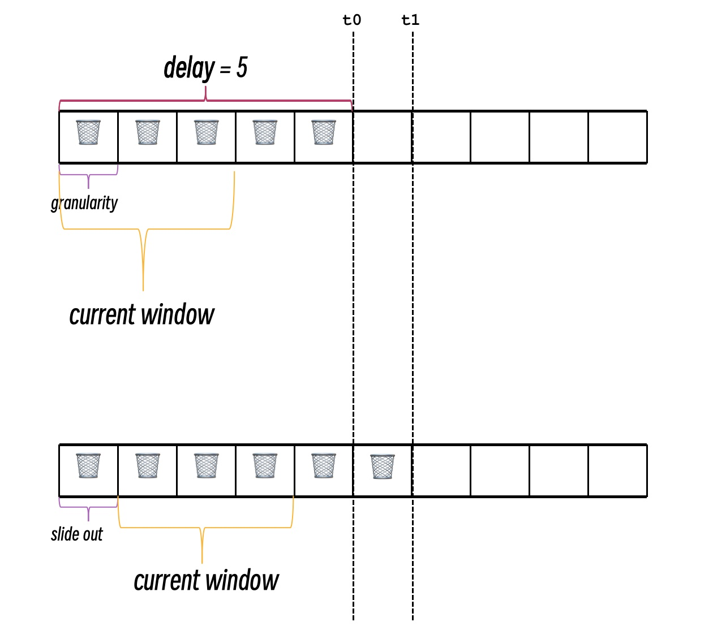

# exp

      

Experimental packages not in std and golang.org/exp

## packages

- **sync**
  - generic sync.Map: modify sync.Map to support generic
  - Phaser: a reusable synchronization barrier, similar in functionality to java.util.concurrent.Phaser
  - Horn: implement the observer pattern via channel

- **container**
  - **heap**: generic heap
  - **list**: generic list
  - **ring**: generic ring
  - **skiplist**: generic skiplist based on [mauricegit/skiplist](https://github.com/mauricegit/skiplist)
  - **set**: discussion at https://github.com/golang/go/discussions/47331
    - **Set**: generic set
    - **SortedSet**: generic sorted set 
  - **maps**:
    - **OrderedMap**: an insert-order map. The main code is forked [wk8/go-ordered-map](https://github.com/wk8/go-ordered-map)
    - **AccessOrderedMap**: an access-order map.
    - **BidiMap**: a bidirectional map. 
  - **Tuple**: a collection of generic tuples.

- **stat**
  - **win**: sliding window 